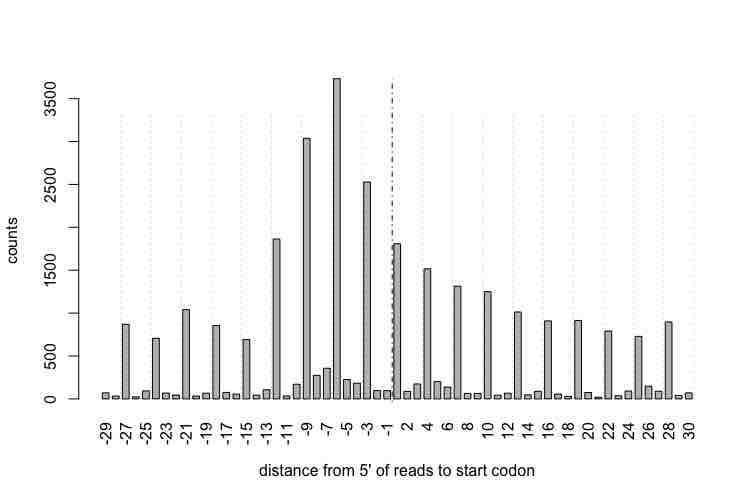

<style>
    pre.vig {
        background-color: #FEFBF5!important;
        border: 1px solid #FFE4AD!important;
    }
</style>

```{r, echo=FALSE, results="hide", warning=FALSE, message=FALSE}
suppressPackageStartupMessages({
  library(ribosomeProfilingQC)
  library(BSgenome.Drerio.UCSC.danRer10)
  library(GenomicFeatures)
  library(Rsamtools)
  library(AnnotationDbi)
  library(motifStack)
})
knitr::opts_chunk$set(warning=FALSE, message=FALSE, fig.width=5, fig.height=3.5)
```

#Introduction

Ribosome footprinting, developed by Jonathan Weissman and 
Nicholas Ingolia[@ingolia2014ribosome],
measures translation by direct quantification of the coding sequence 
currently bound by the 80S ribosome 
(ribosome-protected fragments, RPFs) [@bazzini2014identification]. 
In eukaryotes, the size of RPFs is around 28-nt, 
where the P-site of the ribosome is typically in position 13 from the 5' end of reads.
In bacteria, Allen et. al. were able to more accurately identify the P-site 
from 3' end of reads[@mohammad2019systematically].


There are several packages available in Bioconductor already, including,
_riboSeqR_ [@chung2015use], _RiboProfiling_ [@popa2016riboprofiling] and
_ORFik_[@tjeldnes2018atlas].
These packages are powerful in analyzing the ribosome footprinting data. 
The _ORFik_ package can also be used to find new transcription start sites using 
CageSeq data. 
_RiboWaltz_[@lauria2018ribowaltz] is another popular package which is based on 
R and Bioconductor.

To help researchers quickly assess the quality of their ribosome profiling data,
we have developed the ribosomeProfilingQC package. 
The _ribosomeProfilingQC_ package can be used to easily make diagnostic plots 
to check the mapping quality and frameshifts. In addition, it can preprocess 
ribosome profiling data for subsequent differential analysis. 
We have tried to make this package as user-friendly as possible and 
the only input needed is a bam file of your ribosome footprinting and 
RNAseq data mapped to the genome.

Please note that all following analyses are based on known Open Reading Frame 
(ORF) annotation. 
The sample data provided in the package is mapped to Zebrafish UCSC danRer10 assembly; 
all code related to this assembly will be **highlighted in 
light yellow background** for clarity.

# Quick start

Here is an example using _ribosomeProfilingQC_ with a subset of ribo-seq data.

First install _ribosomeProfilingQC_ and other packages required to run 
the examples.
Please note that the example dataset used here is from zebrafish. 
To run analysis with dataset from a different species or different assembly, 
please install the corresponding Bsgenome and TxDb.
For example, to analyze mouse data aligned to mm10, 
please install BSgenome.Mmusculus.UCSC.mm10, 
and TxDb.Mmusculus.UCSC.mm10.knownGene. 
You can also generate a TxDb object by 
functions `makeTxDbFromGFF` from a local gff file,
or `makeTxDbFromUCSC`, `makeTxDbFromBiomart`, and `makeTxDbFromEnsembl`, 
from online resources in _GenomicFeatures_ package.

```{r, eval=FALSE}
library(BiocManager)
BiocManager::install(c("ribosomeProfilingQC", 
                       "AnnotationDbi", "Rsamtools",
                       "BSgenome.Drerio.UCSC.danRer10",
                       "TxDb.Drerio.UCSC.danRer10.refGene",
                       "motifStack"))
```

If you have trouble in install _ribosomeProfilingQC_, please check your R
version first. The _ribosomeProfilingQC_ package require R >= 4.0.
```{r}
R.version
```

```{r loadLibrary, class.source='vig'}
## load library
library(ribosomeProfilingQC)
library(AnnotationDbi)
library(Rsamtools)
```
## Load genome

In this manual, we will use the fish genome.

```{r loadGenome, class.source='vig'}
library(BSgenome.Drerio.UCSC.danRer10)
## set genome, Drerio is a shortname for BSgenome.Drerio.UCSC.danRer10
genome <- Drerio
```

If your assembly is Human hg38 please load the human library,

```{r, eval=FALSE}
library(BSgenome.Hsapiens.UCSC.hg38)
genome <- Hsapiens
```

If your assembly is Mouse mm10 please load the mouse library,

```{r, eval=FALSE}
library(BSgenome.Mmusculus.UCSC.mm10)
genome <- Mmusculus
```


## Prepare annotaiton CDS

The function `prepareCDS` is used to prepare the information for downstream 
analysis from a `TxDb` object.

```{r, eval=FALSE}
## which is corresponding to BSgenome.Drerio.UCSC.danRer10
library(TxDb.Drerio.UCSC.danRer10.refGene)
txdb <- TxDb.Drerio.UCSC.danRer10.refGene ## give it a short name
CDS <- prepareCDS(txdb)
```

If your assembly is Human hg38 please try to load the library,

```{r, eval=FALSE}
library(TxDb.Hsapiens.UCSC.hg38.knownGene)
txdb <- TxDb.Hsapiens.UCSC.hg38.knownGene ## give it a short name
CDS <- prepareCDS(txdb)
```

If your assembly is Mouse mm10 please try to load the library,

```{r, eval=FALSE}
library(TxDb.Mmusculus.UCSC.mm10.knownGene)
txdb <- TxDb.Mmusculus.UCSC.mm10.knownGene ## give it a short name
CDS <- prepareCDS(txdb)
```

You can also create a TxDb object from a gtf file by _GenomicFeatures::makeTxDbFromGFF_ function.
To get GTF file, you can download it from [ensembl](http://useast.ensembl.org/info/data/ftp/index.html)
or get the online file info via [_AnnotationHub_](#count-for-rpfs).
Here we use a prepared TxDb object for testing.

```{r loadTxDb, class.source='vig'}
## Create a small TxDb object which only contain chr1 information.
library(GenomicFeatures)
txdb <- makeTxDbFromGFF(system.file("extdata",
                                    "Danio_rerio.GRCz10.91.chr1.gtf.gz",
                                    package="ribosomeProfilingQC"),
                        organism = "Danio rerio",
                        chrominfo = seqinfo(Drerio)["chr1"],
                        taxonomyId = 7955)
CDS <- prepareCDS(txdb)
```

## Inputs

The input of _ribosomeProfilingQC_ is bam file. To prepare bam file,
different from _riboSeqR_ package which ask reads mapped to transcriptome, 
_ribosomeProfilingQC_ use the bam file mapped to whole genome. 
To get correctly mapped reads, first try to map adaptor trimmed sequences to 
genome assembly by bowtie2 with following parameters: 
--local --ma 5 --mp 8,4 --rdg 7,7 --rfg 7,7 --fr --nofw
and then fileter the reads mapped to rRNA, tRNA, snRNA, snoRNA and misc_RNA 
from Ensembl and Repeatmasker annotations. After that, map the clean reads to 
genome assembly by tophat2 with following parameters: 
--library-type fr-firststrand --transcriptome-index=Transcriptome_data/genome.
Because the library type of ribo-seq is usally strand-specific, 
please make sure to map the reads with correct library type.

```{r inputBamFile, class.source='vig'}
library(Rsamtools)
## input the bamFile from the ribosomeProfilingQC package 
bamfilename <- system.file("extdata", "RPF.WT.1.bam",
                           package="ribosomeProfilingQC")
## For your own data, please set bamfilename as your file path.
## For example, your bam file is located at C:\mydata\a.bam
## you want to set bamfilename = "C:\\mydata\\a.bam"
## or you can change your working directory by
## setwd("C:\\mydata")
## and then set bamfilename = "a.bam"
yieldSize <- 10000000
bamfile <- BamFile(bamfilename, yieldSize = yieldSize)
```

## Estimate P site

As it shown in the above figure, P site of the ribosome is in position 13 
(if using RNase I).
However, in different experiments, the P site may be shifted due to various 
experimental conditions such as the choice of enzyme and the cell type.
The `estimatePsite` function can be used to check the P site. 
The `estimatePsite` function will search start/stop codons that occur in the 
reads.
The `estimatePsite` will only use 12, 13 or 14 as best P site candidates 
when searching from the 5' end.


```{r estimatePsite, class.source='vig'}
estimatePsite(bamfile, CDS, genome)
```

It has been shown that for certain enzymes, such as MNase, 
estimating the P site from the 3’ end works much better[@mohammad2019systematically].
The `estimatePsite` will use 15, 16 or 17 as best P site candidates 
when searching from the 3' end.

```{r estimatePsite3end, class.source='vig'}
estimatePsite(bamfile, CDS, genome, anchor = "3end")
```


## Plot start/stop windows

The `readsEndPlot` function will plot the 5' end or 3' end reads shifted 
from the start/stop position of CDS.
There is no difference when assign the reading frame for most of the reads 
if you set best P site to 13 or 10 or 16 (from 5' end). 
The `readsEndPlot`
can help users to determine the real best Psite. 
In the example below, the start codon is enriched in position -9 from 
the 5' end of reads and in position 19 from the 3' end of reads. 
This means there are a lot of ribosome that are docking at the translation 
start position and most of the reads length are 28 nt.


```{r readsEndPlot, fig.height=4, fig.width=6, class.source='vig'}
readsEndPlot(bamfile, CDS, toStartCodon=TRUE)
readsEndPlot(bamfile, CDS, toStartCodon=TRUE, fiveEnd=FALSE)
```

If you see following distribution, that means lots of gene are in
active expression.



If you see a warning or error message complaining about the disagreement of
chromosome sequences, please verify you are using the TxDb object with
correct genome assembly. 
If this warning message is for the patch chromosomes you are not interested,
you can ignore the warning messages.

## Read all P site coordinates

The `getPsiteCoordinates` function is used to read all P site coordinates. 
Ideally, the bestpsite should be 13. 
To test the data quality, we set bestpsite = 13.

```{r getPsiteCoordinates, class.source='vig'}
pc <- getPsiteCoordinates(bamfile, bestpsite = 13)
```

## Fragment size distribution

Ribosome-protected fragments should ideally be 27 to 29-nt long. 
To check the fragment size distribution, use the following function:

```{r readsLen, class.source='vig'}
readsLen <- summaryReadsLength(pc)
```

### Filter the reads by fragment size

To filter reads by their length for downstream analysis, 
use the following script:

```{r filterSize, class.source='vig'}
## for this QC demo, we will only use reads length of 28-29 nt.
pc.sub <- pc[pc$qwidth %in% c(28, 29)]
```


## Sense/antisense strand plot

Most of the reads should be mapped to sense strand 
because the ribo-seq library is strand-specific.

```{r strandPlot, fig.width=2,fig.height=3, class.source='vig'}
strandPlot(pc.sub, CDS)
```

## Genomic element distribution

For ribosome footprinting, most of the reads should map to the CDS region. 
The `readsDistribution` function will show the P site locations 
in different genomic elements: CDS, 5'UTR, 3'UTR, other type exon,
intron, promoter, downstream or intergenic region.
A high downstream percentage indicates that there is a high percentage 
of alternative polyAdenylation sites usage from annotation data.
A high percentage in intronic regions indicates the possibility of 
intron-retaining transcripts.

```{r readsDistribution, fig.width=7, fig.height=4, class.source='vig'}
pc.sub <- readsDistribution(pc.sub, txdb, las=2)
```

## Metagene analysis plot for 5'UTR/CDS/3'UTR

A metagene plot can indicate the reads distribution in 5'UTR, CDS and
3'UTR region.

```{r metaPlotUTR5cdsUTR3, fig.width=5, fig.height=4, class.source='vig'}
cvgs.utr5 <- coverageDepth(RPFs = bamfilename, gtf = txdb, region="utr5")
cvgs.CDS <- coverageDepth(RPFs = bamfilename, gtf = txdb, region="cds")
cvgs.utr3 <- coverageDepth(RPFs = bamfilename, gtf = txdb, region="utr3")
metaPlot(cvgs.utr5, cvgs.CDS, cvgs.utr3, sample=1)
```


## Reading frame

Function `assignReadingFrame` is used to set the reading frame for the P sites
located within the known annotated CDS.
The `plotDistance2Codon` function can be used to plot the reading frame usage 
in transcription initiation or termination sites.
Function `plotFrameDensity` can be used to collapse all the RPFs in each frame.
These plots can help you to double check if the p-site position is correct 
or not. 
If it is correct, most of the reads should be assigned to frame0.


```{r assignReadingFrame, fig.width=5, fig.height=3, class.source='vig'}
pc.sub <- assignReadingFrame(pc.sub, CDS)
plotDistance2Codon(pc.sub)
```
```{r plotFrameDensity, fig.width=2.5,fig.height=3, class.source='vig'}
plotFrameDensity(pc.sub)
```

To determine how many of raw reads are mapping with P sites in frame 0.

```{r allReadFrame, fig.width=2.5,fig.height=3, class.source='vig'}
pc <- assignReadingFrame(pc, CDS)
plotFrameDensity(pc)
```


Function `plotTranscript` can be used to view the reading frame distribution
for given transcripts.

```{r plotTranscript, fig.width=8, fig.height=6, class.source='vig'}
plotTranscript(pc.sub, c("ENSDART00000161781", "ENSDART00000166968",
                         "ENSDART00000040204", "ENSDART00000124837"))
```

## ORFscore vs coverageRate

ORFscore[@bazzini2014identification] can be used to quantify the biased 
distribution of RPFs toward the first frame of a given CDS. 
Coverage rate for whole CDS can help researchers to check the RPFs distribution
along whole CDS. 
Coverage is determined by measuring the proportion of in-frame CDS positions 
with >= 1 reads.
If coverage is about 1, the whole CDS is covered by active ribosomes.

```{r ORFscore, eval=FALSE, class.source='vig'}
cvg <- frameCounts(pc.sub, coverageRate=TRUE)
ORFscore <- getORFscore(pc.sub)
## Following code will plot the ORFscores vs coverage.
## Try it by removing the '#'. 
#plot(cvg[names(ORFscore)], ORFscore,
#     xlab="coverage ORF1", ylab="ORF score",
#     type="p", pch=16, cex=.5, xlim=c(0, 1))
```

# Bad case

Here, we show ribosome footprinting data that is poor quality data and 
should not bed used for downstream analyses. 

```{r badStrandPlot, fig.width=2,fig.height=3, class.source='vig'}
bamfilename <- system.file("extdata", "RPF.chr1.bad.bam",
                           package="ribosomeProfilingQC")
yieldSize <- 10000000
bamfile <- BamFile(bamfilename, yieldSize = yieldSize)
pc <- getPsiteCoordinates(bamfile, bestpsite = 13)
pc.sub <- pc[pc$qwidth %in% c(27, 28, 29)]
## in this example, most of the reads mapped to the antisense strand
## which may indicate that there are some issues in the mapping step
strandPlot(pc.sub, CDS)
```
```{r badReadsDistribution, fig.width=7, fig.height=4, class.source='vig'}
## in this exaple, most of the reads mapped to inter-genic regions
## rather than the CDS, which could indicate that ribosome protected
## fragments are not being properly isolated/selected
pc.sub <- readsDistribution(pc.sub, txdb, las=2)
```
```{r badAssignReadingFrame, fig.width=5, fig.height=4, class.source='vig'}
## Selection of the proper P site is also critical.
## If we assign the wrong P site position the frame mapping will 
## likely be impacted. 
pc <- getPsiteCoordinates(bamfile, 12)
pc.sub <- pc[pc$qwidth %in% c(27, 28, 29)]
pc.sub <- assignReadingFrame(pc.sub, CDS)
plotDistance2Codon(pc.sub)
```
```{r badPlotFrameDensity, fig.width=2.5,fig.height=3, class.source='vig'}
plotFrameDensity(pc.sub)
```


# Prepare for downstream analysis

## RPFs only

### Count for RPFs

Downstream analysis including differential analysis, comparison with RNAseq,
and so on. 
Function `frameCounts` will generate a count vector for each transcript or gene, 
which can be used for differential analysis.
`countReads` can be used for count multiple files of ribo-seq.

```{r countReads, class.source='vig'}
library(ribosomeProfilingQC)
library(AnnotationDbi)
path <- system.file("extdata", package="ribosomeProfilingQC")
RPFs <- dir(path, "RPF.*?\\.[12].bam$", full.names=TRUE)
gtf <- file.path(path, "Danio_rerio.GRCz10.91.chr1.gtf.gz")
cnts <- countReads(RPFs, gtf=gtf, level="gene",
                   bestpsite=13, readsLen=c(28,29))
head(cnts$RPFs)
## To save the cnts, please try following codes by removing '#'
# write.csv(cbind(cnts$annotation[rownames(cnts$RPFs), ], cnts$RPFs),
#           "counts.csv")
```

To get GTF file, you can download it from [ensembl](http://useast.ensembl.org/info/data/ftp/index.html)
or get the online file info via `AnnotationHub`.

```{r prePareGTF, eval=FALSE}
BiocManager::install("AnnotationHub")
library(AnnotationHub)
ah = AnnotationHub()
## for human hg38
hg38 <- query(ah, c("Ensembl", "GRCh38", "gtf"))
hg38 <- hg38[length(hg38)]
gtf <- mcols(hg38)$sourceurl
## for mouse mm10
mm10 <- query(ah, c("Ensembl", "GRCm38", "gtf"))
mm10 <- mm10[length(mm10)]
gtf <- mcols(mm10)$sourceurl
```


### Differential analysis only for RPFs

```{r differentialByEdgeR, class.source='vig'}
library(edgeR)  ## install edgeR by BiocManager::install("edgeR")
gp <- c("KD", "KD", "CTL", "CTL") ## sample groups: KD:knockdown; CTL:Control
y <- DGEList(counts = cnts$RPFs, group = gp)
y <- calcNormFactors(y)
design <- model.matrix(~0+gp)
colnames(design) <- sub("gp", "", colnames(design))
y <- estimateDisp(y, design)
## To perform quasi-likelihood F-tests:
fit <- glmQLFit(y, design)
qlf <- glmQLFTest(fit)
topTags(qlf, n=3) # set n=nrow(qlf) to pull all results.
## To perform likelihood ratio tests:
fit <- glmFit(y, design)
lrt <- glmLRT(fit)
topTags(lrt, n=3) # set n=nrow(lrt) to pull all results.
```

### Alternative splicing, translation initiation and polyadenylation


```{r alternativeSplicing, fig.width=6, fig.height=4, class.source='vig'}
coverage <- coverageDepth(RPFs[grepl("KD1|WT", RPFs)], 
                          gtf=txdb, 
                          level="gene",
                          region="feature with extension")
group1 <- c("RPF.KD1.1", "RPF.KD1.2")
group2 <- c("RPF.WT.1", "RPF.WT.2")
## subset the data, for sample run only
coverage <- lapply(coverage, function(.ele){##do not run this for real data
  .ele$coverage <- lapply(.ele$coverage, `[`, i=seq.int(50))
  .ele$granges <- .ele$granges[seq.int(50)]
  .ele
})
se <- spliceEvent(coverage, group1, group2)
table(se$type)
plotSpliceEvent(se, se$feature[1], coverage, group1, group2)
```


## RPFs and RNA-seq

### By counts

#### Count for RPFs and RNA-seq

The `countReads` function can be used to count multiple files of ribo-seq and 
RNA-seq data.

```{r countRPFandRNA, class.source='vig'}
path <- system.file("extdata", package="ribosomeProfilingQC")
RPFs <- dir(path, "RPF.*?\\.[12].bam$", full.names=TRUE)
RNAs <- dir(path, "mRNA.*?\\.[12].bam$", full.names=TRUE)
gtf <- file.path(path, "Danio_rerio.GRCz10.91.chr1.gtf.gz")
```
```{r countReadsRPFandRNA,eval=FALSE, class.source='vig'}
## make sure that the order of the genes listed in the bam files for RPFs
## and RNAseq data is the same.
cnts <- countReads(RPFs, RNAs, gtf, level="tx")
## To save the cnts, please try following codes by removing '#'
# rn <- cnts$annotation$GeneID
# write.csv(cbind(cnts$annotation, 
#                 cnts$RPFs[match(rn, rownames(cnts$RPFs)), ],
#                 cnts$mRNA[match(rn, rownames(cnts$mRNA)), ]),
#           "counts.csv")
```
```{r,include=FALSE}
cnts <- readRDS(file.path(path, "cnts.rds"))
```


#### Translational Efficiency (TE)

The absolute level of ribosome occupancy is strongly correlated with RNA levels 
for both coding and noncoding transcripts.
Translational efficiency is introduced[@ingolia2009genome] 
to show the correlation.
TE is the ratio of normalized ribosome footprint abundance to mRNA density.
A common normalization method is using 
Fragments Per Kilobase of transcript per Million mapped reads (FPKM).


```{r translationalEfficiency, class.source='vig'}
fpkm <- getFPKM(cnts)
TE <- translationalEfficiency(fpkm)
```

#### Differential analysis for TE

We suppose that the log2 transformed translational efficiency that 
we calculated by the ratios of RPFs to mRNAs 
has a linear correlation with real translational efficiency. 
We then use the _limma_ package to test the differential 
translational efficiency.

```{r differentialTEbyLimma, class.source='vig'}
library(limma)
gp <- c("KD", "KD", "CTL", "CTL") ## sample groups: KD:knockdown; CTL:Control
TE.log2 <- log2(TE$TE + 1)
#plot(TE.log2[, 1], TE.log2[, 3], 
#     xlab=colnames(TE.log2)[1], ylab=colnames(TE.log2)[3],
#     main="Translational Efficiency", pch=16, cex=.5)
design <- model.matrix(~0+gp)
colnames(design) <- sub("gp", "", colnames(design))
fit <- lmFit(TE.log2, design)
fit2 <- eBayes(fit)
topTable(fit2, number=3) ## set number=nrow(fit2) to pull all results
```


### By coverage

#### Maximum N-mer translational efficiency

If we plot the correlation mRNAs or RPFs levels to translational efficiency  
calculated by all counts within a transcript,
we will find that TE is not well normalized. 
It shows a higher value in lowly expressed transcripts 
and a low value in highly expressed transcripts.

```{r plotTE, class.source='vig'}
plotTE(TE, sample=2, xaxis="mRNA", log2=TRUE, pch=16, cex=.5)
#plotTE(TE, sample=2, xaxis="RPFs", log2=TRUE, pch=16, cex=.5)
```

This issue can be fixed by calculating the maximum value (TE max) in the most
highly ribosome-occupied 90 nt window within a feature[@ingolia2009genome]. 
Please note that the normalization method for TE max is not FPKM any more.

```{r plotTE90, class.source='vig'}
cvgs <- coverageDepth(RPFs, RNAs, txdb)
TE90 <- translationalEfficiency(cvgs, window = 90, normByLibSize=TRUE)
plotTE(TE90, sample=2, xaxis="mRNA", log2=TRUE, pch=16, cex=.5)
plotTE(TE90, sample=2, xaxis="RPFs", log2=TRUE, pch=16, cex=.5)
```

Above examples are TE90 for CDS region. Following codes show how to 
calculate TE90 for 3'UTR regions.

```{r, include=FALSE}
cvgs.utr3 <- coverageDepth(RPFs, RNAs, txdb, region="utr3")
```

```{r, eval=FALSE, class.source='vig'}
cvgs.utr3 <- coverageDepth(RPFs, RNAs, txdb, region="utr3")
TE90.utr3 <- translationalEfficiency(cvgs.utr3, window = 90)
## Following code will plot the TE90 for 3'UTR regions.
## Try it by removing the '#'. 
#plotTE(TE90.utr3, sample=2, xaxis="mRNA", log2=TRUE, pch=16, cex=.5)
#plotTE(TE90.utr3, sample=2, xaxis="RPFs", log2=TRUE, pch=16, cex=.5)
```


#### Ribosome Release Score (RRS)

RRS is calculated as the ratio of RPFs (normalized by RNA-seq reads) in 
the CDS to RPFs in the 3'UTR.
Because it is hard to define the CDS region for non-coding RNAs, 
RRS of non-coding RNAs can not be calculated by Function `ribosomeReleaseScore`.

```{r, eval=FALSE, class.source='vig'}
RRS <- ribosomeReleaseScore(TE90, TE90.utr3, log2 = TRUE)
## Following code will compare RSS for 2 samples.
## Try it by removing the '#'. 
#plot(RRS[, 1], RRS[, 3],
#     xlab="log2 transformed RRS of KD1", 
#     ylab="log2 transformed RRS of WT1")
## Following code will show RSS along TE90.
## Try it by removing the '#'. 
#plot(RRS[, 1], log2(TE90$TE[rownames(RRS), 1]),
#     xlab="log2 transformed RSS of KD1", 
#     ylab="log2 transformed TE of KD1")
```

#### Metagene analysis plot

Plot metagene coverage for CDS, 5'UTR and 3'UTR.
You will notice that the coverage for the RPF data is 
much more enriched in the CDS as compared to the 
corresponding RNAseq data

```{r metaPlot, class.source='vig'}
cvgs.utr5 <- coverageDepth(RPFs, RNAs, txdb, region="utr5")
## set sample to different number to plot metagene analysis 
## for different samples
#metaPlot(cvgs.utr5, cvgs, cvgs.utr3, sample=2, xaxis = "RPFs")
metaPlot(cvgs.utr5, cvgs, cvgs.utr3, sample=2, xaxis = "mRNA")
```

# Fragment Length Organization Similarity Score (FLOSS) [@ingolia2014ribosome]

FLOSS can be used to compare the distribution of reads length to
a background such as a cluster of genes.
The gene cluster could be extracted from gtf/gff files downloaded from [ensembl](http://useast.ensembl.org/info/data/ftp/index.html).

```{r eval=FALSE}
## documentation: https://useast.ensembl.org/Help/Faq?id=468
gtf <- import("Danio_rerio.GRCz10.91.gtf.gz")
```
The gtf files can be also download via `AnnotationHub`

```{r eval=FALSE}
BiocManager::install("AnnotationHub")
library(AnnotationHub)
ah = AnnotationHub()
## for human hg38
hg38 <- query(ah, c("Ensembl", "GRCh38", "gtf"))
hg38 <- hg38[[length(hg38)]]
## for mouse mm10
mm10 <- query(ah, c("Ensembl", "GRCm38", "gtf"))
mm10 <- mm10[[length(mm10)]]
## because the gene ids in TxDb.Mmusculus.UCSC.mm10.knownGene and
## TxDb.Hsapiens.UCSC.hg38.knownGene
## are entriz_id, the gene_id in mm10 or hg38 need to changed to entriz_id.
library(ChIPpeakAnno)
library(org.Mm.eg.db)
mm10$gene_id <- ChIPpeakAnno::xget(mm10$gene_id, org.Mm.egENSEMBL2EG)
library(org.Hg.eg.db)
hg38$gene_id <- ChIPpeakAnno::xget(hg38$gene_id, org.Mm.egENSEMBL2EG)
```

```{r eval=FALSE}
gtf <- gtf[!is.na(gtf$gene_id)]
gtf <- gtf[gtf$gene_id!=""]
## protein coding
protein <- 
  gtf$gene_id[gtf$transcript_biotype %in% 
                  c("IG_C_gene", "IG_D_gene", "IG_J_gene", "IG_LV_gene", 
                    "IG_M_gene", "IG_V_gene", "IG_Z_gene", 
                    "nonsense_mediated_decay", "nontranslating_CDS", 
                    "non_stop_decay", 
                    "protein_coding", "TR_C_gene", "TR_D_gene", "TR_gene", 
                    "TR_J_gene", "TR_V_gene")]
## mitochondrial genes
mito <- gtf$gene_id[grepl("^mt\\-", gtf$gene_name) | 
                        gtf$transcript_biotype %in% c("Mt_tRNA", "Mt_rRNA")]
## long noncoding
lincRNA <- 
  gtf$gene_id[gtf$transcript_biotype %in% 
                  c("3prime_overlapping_ncrna", "lincRNA", 
                    "ncrna_host", "non_coding")]
## short noncoding
sncRNA <- 
  gtf$gene_id[gtf$transcript_biotype %in% 
                  c("miRNA", "miRNA_pseudogene", "misc_RNA", 
                    "misc_RNA_pseudogene", "Mt_rRNA", "Mt_tRNA", 
                    "Mt_tRNA_pseudogene", "ncRNA", "pre_miRNA", 
                    "RNase_MRP_RNA", "RNase_P_RNA", "rRNA", "rRNA_pseudogene", 
                    "scRNA_pseudogene", "snlRNA", "snoRNA", 
                    "snRNA_pseudogene", "SRP_RNA", "tmRNA", "tRNA",
                    "tRNA_pseudogene", "ribozyme", "scaRNA", "sRNA")]
## pseudogene
pseudogene <- 
  gtf$gene_id[gtf$transcript_biotype %in% 
                  c("disrupted_domain", "IG_C_pseudogene", "IG_J_pseudogene", 
                    "IG_pseudogene", "IG_V_pseudogene", "processed_pseudogene", 
                    "pseudogene", "transcribed_processed_pseudogene",
                    "transcribed_unprocessed_pseudogene", 
                    "translated_processed_pseudogene", 
                    "translated_unprocessed_pseudogene", "TR_J_pseudogene", 
                    "TR_V_pseudogene", "unitary_pseudogene", 
                    "unprocessed_pseudogene")]
danrer10.annotations <- list(protein=unique(protein), 
                             mito=unique(mito),
                             lincRNA=unique(lincRNA),
                             sncRNA=unique(sncRNA),
                             pseudogene=unique(pseudogene))
```

Here we load the pre-saved chr1 annotations for sample codes.
```{r loadPresavedAnnotations, class.source='vig'}
danrer10.annotations <- 
  readRDS(system.file("extdata",
                      "danrer10.annotations.rds",
                      package = "ribosomeProfilingQC"))
```

```{r, fig.width=4, fig.height=4, class.source='vig'}
library(ribosomeProfilingQC)
library(GenomicFeatures)
## prepare CDS annotation
txdb <- makeTxDbFromGFF(system.file("extdata",
                                    "Danio_rerio.GRCz10.91.chr1.gtf.gz",
                                    package="ribosomeProfilingQC"),
                        organism = "Danio rerio",
                        chrominfo = seqinfo(Drerio)["chr1"],
                        taxonomyId = 7955)
CDS <- prepareCDS(txdb)

library(Rsamtools)
## input the bamFile from the ribosomeProfilingQC package 
bamfilename <- system.file("extdata", "RPF.WT.1.bam",
                           package="ribosomeProfilingQC")
## For your own data, please set bamfilename as your file path.
yieldSize <- 10000000
bamfile <- BamFile(bamfilename, yieldSize = yieldSize)

pc <- getPsiteCoordinates(bamfile, bestpsite = 13)
readsLengths <- 20:34
fl <- FLOSS(pc, ref = danrer10.annotations$protein, 
            CDS = CDS, readLengths=readsLengths, level="gene", draw = FALSE)
fl.max <- t(fl[c(1, which.max(fl$cooks.distance)), as.character(readsLengths)])
matplot(fl.max, type = "l", x=readsLengths, 
        xlab="Fragment Length", ylab="Fraction of Reads", 
        col = c("gray", "red"), lwd = 2, lty = 1)
legend("topright",  legend = c("ref", "selected gene"), 
       col = c("gray", "red"), lwd = 2, lty = 1, cex=.5)
```


# References
