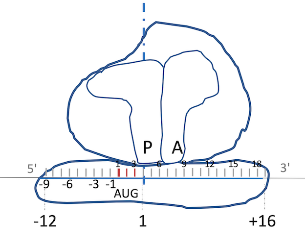
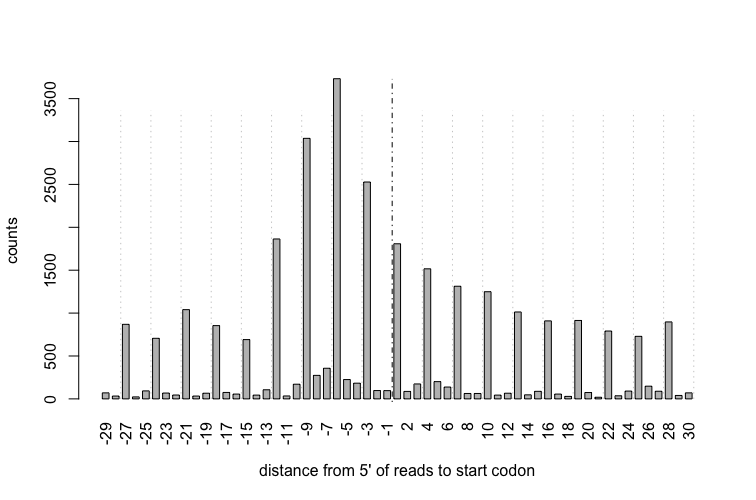

```{r, echo=FALSE, results="hide", warning=FALSE, message=FALSE}
suppressPackageStartupMessages({
  library(ribosomeProfilingQC)
  library(BSgenome.Drerio.UCSC.danRer10)
  library(Rsamtools)
  library(AnnotationDbi)
  library(motifStack)
})
knitr::opts_chunk$set(warning=FALSE, message=FALSE)
```

#Introduction

Ribosome profiling measures translation by direct quantification of the coding sequence 
currently bound by the 80S ribosome (ribosome-protected fragments, RPFs) [@bazzini2014identification]. 
The size of RPFs is around 28-nt, where the P-site of the ribosome is in position 13.


There are several packages available in Bioconductor already, riboSeqR [@chung2015use], RiboProfiling [@popa2016riboprofiling] and ORFik[@tjeldnes2018atlas].
These packages are powerful in analyzing the ribosome profiling data. 
ORFik package can also seek the new transcription start site using CageSeq data.

To help researchers quickly assess the quality of ribosome profiling data, we have
developed the ribosomeProfilingQC package. 
The `ribosomeProfilingQC` package can easily make diagnostic plots to check
the mapping quality and frameshifts. In addition, it can preprocess 
ribosome profiling data for subsequent differential analysis. 

Please note that all following analyses are based on known annotation.

# Quick start

Here is an example using ribosomeProfilingQC with a subset of ribo-seq data.

First install ribosomeProfilingQC and other packages required to run the examples.
Please note that the example dataset used here is from zebrafish. To run analysis with dataset
from a different species or different assembly, please install the corresponding Bsgenome and TxDb.
For example, to analyze mouse data aligned to mm10, please install BSgenome.Mmusculus.UCSC.mm10,
and TxDb.Mmusculus.UCSC.mm10.knownGene. 
You can also generate a TxDb object by functions `makeTxDbFromGFF` from a local gff file,
or `makeTxDbFromUCSC`, `makeTxDbFromBiomart`, and `makeTxDbFromEnsembl`, from online resources in
`GenomicFeatures` package.

```{r, eval=FALSE}
library(BiocManager)
BiocManager::install(c("ribosomeProfilingQC", 
                       "AnnotationDbi", "Rsamtools",
                       "BSgenome.Drerio.UCSC.danRer10",
                       "TxDb.Drerio.UCSC.danRer10.refGene",
                       "motifStack"))
```


```{r}
## load library
library(ribosomeProfilingQC)
library(AnnotationDbi)
library(Rsamtools)
```
## Load genome

Here we use fish genome.

```{r}
library(BSgenome.Drerio.UCSC.danRer10)
## set genome, Drerio is a shortname for BSgenome.Drerio.UCSC.danRer10
genome <- Drerio
```

If your assembly are Human hg38 please try to load library,

```{r, eval=FALSE}
library(BSgenome.Hsapiens.UCSC.hg38)
genome <- Hsapiens
```

If your assembly are Mouse mm10 please try to load library,

```{r, eval=FALSE}
library(BSgenome.Mmusculus.UCSC.mm10)
genome <- Mmusculus
```


## Prepare annotaiton CDS

Function `prepareCDS` is used to prepare the information for downstream analysis from a `TxDb` object.

```{r, eval=FALSE}
library(TxDb.Drerio.UCSC.danRer10.refGene) ## which is corresponding to BSgenome.Drerio.UCSC.danRer10
txdb <- TxDb.Drerio.UCSC.danRer10.refGene ## give it a short name
CDS <- prepareCDS(txdb)
```

If your assembly are Human hg38 please try to load library,

```{r, eval=FALSE}
library(TxDb.Hsapiens.UCSC.hg38.knownGene)
txdb <- TxDb.Hsapiens.UCSC.hg38.knownGene ## give it a short name
CDS <- prepareCDS(txdb)
```

If your assembly are Mouse mm10 please try to load library,

```{r, eval=FALSE}
library(TxDb.Mmusculus.UCSC.mm10.knownGene)
txdb <- TxDb.Mmusculus.UCSC.mm10.knownGene ## give it a short name
CDS <- prepareCDS(txdb)
```

Here we use a prepared TxDb object for testing.

```{r}
## load a small TxDb object which only contain chr1 information.
txdb <- loadDb(system.file("extdata", "danRer10.chr1.txdb",
               package="ribosomeProfilingQC"))
CDS <- prepareCDS(txdb)
```

## Inputs

The input of `ribosomeProfilingQC` is bam file. To prepare bam file,
different from riboSeqR package which ask reads mapped to transcriptome, 
`ribosomeProfilingQC` use the bam file mapped to whole genome. 
To get correct mapped reads, first try to map adaptor trimmed sequences to genome assembly by bowtie2
with following parameters: --local --ma 5 --mp 8,4 --rdg 7,7 --rfg 7,7 --fr --nofw
and then fileter the reads mapped to rRNA, tRNA, snRNA, snoRNA and misc_RNA from Ensembl and
Repeatmasker annotations. After that map the clean reads to genome assembly by tophat2 with 
following parameters:  --library-type fr-firststrand --transcriptome-index=Transcriptome_data/genome.
Because the library type of ribo-seq usally is strand-specific, please make sure to map the reads with correct library type.

```{r}
library(Rsamtools)
## input the bamFile from the ribosomeProfilingQC package 
bamfilename <- system.file("extdata", "RPF.chr1.bam",
                           package="ribosomeProfilingQC")
## For your own data, please set bamfilename as your file path.
yieldSize <- 10000000
bamfile <- BamFile(bamfilename, yieldSize = yieldSize)
```

## Estimate P site

As it shown in the above figure, P site of the ribosome is in position 13. However, 
in different experiments, the P site may shift caused by experiment conditions such as enzyme.
`estimatePsite` function can be used to check the P site. 
`estimatePsite` function will search start/stop codon occurred in reads and 
`bestPsite` function will meta-plot the distribution for each position.
The `estimatePsite` will only use 12, 13 or 14 as best P site candidates.


```{r}
psite <- estimatePsite(bamfile, CDS, genome)
bestpsite <- bestPsite(psite)
```

## Plot start/stop windows

`readsEndPlot` function plot the 5' end or 3' end reads shifted from start/stop position of CDS.
There is no difference for most of the reads if you set best P site to 13 or 10. `readsEndPlot`
can help users to determine the real best Psite. 
It is shown here that the start codon is enriched in position -9 from 5' end of reads and
in position 19 from 3' end of reads. That means there are lots of ribosome are docking at translation start position and most of the reads length are 28 nt.
{weight=50%}


```{r}
readsEndPlot(bamfile, CDS, toStartCodon=TRUE)
readsEndPlot(bamfile, CDS, toStartCodon=TRUE, fiveEnd=FALSE)
readsEndPlot(bamfile, CDS, toStartCodon=FALSE)
```
If you see following distribution, that means lots of gene are in active expression.


## Read all P site coordinates

`getPsiteCoordinates` function is used to read all P site coordinates. Ideally, the bestpsite should be 13. To test the data quality, we set bestpsite = 13.

```{r}
pc <- getPsiteCoordinates(bamfile, bestpsite = 13)
```

## Fragment size distribution

Ribosome-protected fragments ideally are 27 to 29-nt long. 
To check the fragment size distribution can help researchers to make sure the fragment size is correct.

```{r}
readsLen <- summaryReadsLength(pc)
```

### Filter the reads by fragment size

```{r}
## for QC we only use reads length 28-29
pc.sub <- pc[pc$qwidth %in% c(28, 29)]
```


## Sense/antisense strand plot

Because the library is strand-specific, most of the reads should be mapped to sense strand.

```{r}
strandPlot(pc.sub, CDS)
```

## Genomic element distribution

Most of the reads should locate in CDS region. `readsDistribution` function will show the P site locations in different genomic elements: CDS, 5'UTR, 3'UTR, other type exon, intron, promoter, downstream or intergenic region.
High downstream percentage indicates the high percentage of alternative polyAdenylation sites usage from annotation data.
High percentage in intron region indicates the possibility of intron-retaining transcripts.
```{r}
pc.sub <- readsDistribution(pc.sub, txdb, las=2)
```

## Metagene analysis plot for 5'UTR/CDS/3'UTR

Metagene plot can indicate the reads distribution in 5'UTR, CDS and 3'UTR region.

```{r}
gtf <- system.file("extdata", "Danio_rerio.GRCz10.91.chr1.gtf.gz", 
                   package="ribosomeProfilingQC")
cvgs.utr5 <- coverageDepth(RPFs = bamfilename, gtf = gtf, region="utr5")
cvgs.CDS <- coverageDepth(RPFs = bamfilename, gtf = gtf, region="cds")
cvgs.utr3 <- coverageDepth(RPFs = bamfilename, gtf = gtf, region="utr3")
metaPlot(cvgs.utr5, cvgs.CDS, cvgs.utr3, sample=1)
```


## Reading frame

Function `assignReadingFrame` is used to set the reading frame for the P sites located within known CDS.
The `plotDistance2Codon` function can be used to plot the reading frame usage in transcription initiation or termination sites.
Function `plotFrameDensity` can be used to collapse all the RPFs in each frame.
These plots can help you to double check if the p-site position is correct or not. 
If it is correct, most of the reads should be assigned to frame0.


```{r}
pc.sub <- assignReadingFrame(pc.sub, CDS)
plotDistance2Codon(pc.sub)
plotDistance2Codon(pc.sub, start=FALSE)
plotFrameDensity(pc.sub)
```

To determine how many of raw reads are mapping with P sites in frame 0.

```{r}
pc <- assignReadingFrame(pc, CDS)
plotFrameDensity(pc)
```


Function `plotTranscript` can be used to view the reading frame distribution for given transcripts.

```{r}
plotTranscript(pc.sub, c("ENSDART00000161781", "ENSDART00000166968",
                         "ENSDART00000040204", "ENSDART00000124837"))
```

## ORFscore vs coverageRate

ORFscore[@bazzini2014identification] can be used to quantify the biased distribution 
of RPFs toward the first frame of a given CDS. 
Coverage rate for whole CDS can help researchers to check the RPFs distribution along whole CDS. 
Coverage is determined by measuring the proportion of in-frame CDS positions with >= 1 reads.
If coverage is about 1, the whole CDS is covered by active ribosomes.

```{r}
cvg <- frameCounts(pc.sub, coverageRate=TRUE)

ORFscore <- getORFscore(pc.sub)
plot(cvg[names(ORFscore)], ORFscore,
     xlab="coverage ORF1", ylab="ORF score",
     type="p", pch=16, cex=.5, xlim=c(0, 1))
```

# Bad case

Here I show a bad case.

```{r}
bamfilename <- system.file("extdata", "RPF.chr1.bad.bam",
                           package="ribosomeProfilingQC")
yieldSize <- 10000000
bamfile <- BamFile(bamfilename, yieldSize = yieldSize)
pc <- getPsiteCoordinates(bamfile, bestpsite = 13)
pc.sub <- pc[pc$qwidth %in% c(27, 28, 29)]
## here will show most of the reads mapped to antisense strand
## which indicate that there may have some issue in mapping step
strandPlot(pc.sub, CDS)
## here will show most of the reads mapped to inter-genic region 
pc.sub <- readsDistribution(pc.sub, txdb, las=2)
## If we assign wrong P site postion
pc <- getPsiteCoordinates(bamfile, 12)
pc.sub <- pc[pc$qwidth %in% c(27, 28, 29)]
pc.sub <- assignReadingFrame(pc.sub, CDS)
plotDistance2Codon(pc.sub)
plotDistance2Codon(pc.sub, start=FALSE)
plotFrameDensity(pc.sub)
```

# References
