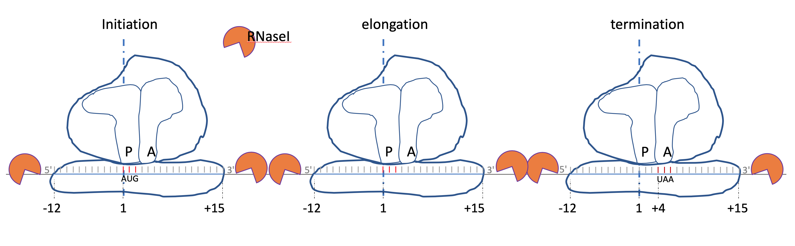

```{r, echo=FALSE, results="hide", warning=FALSE, message=FALSE}
suppressPackageStartupMessages({
  library(ribosomeProfilingQC)
  library(BSgenome.Drerio.UCSC.danRer10)
  library(Rsamtools)
  library(AnnotationDbi)
  library(motifStack)
})
knitr::opts_chunk$set(warning=FALSE, message=FALSE)
```

#Introduction

Ribosome profiling measures translation by direct quantification of the coding sequence 
currently bound by the 80S ribosome (ribosome-protected fragments, RPFs) [@bazzini2014identification]. 
The size of RPFs is around 28-nt, where the P-site of the ribosome is in position 13.



There are several packages available in Bioconductor already, riboSeqR [@chung2015use], RiboProfiling [@popa2016riboprofiling] and ORFik[@tjeldnes2018atlas].
These packages are powerful in analyze the ribosome profiling data. 
And ORFik package can also find the new transcription start site with the use of CageSeq data.

To help researchers quickly assess the quality of ribosome profiling data, We have
developed the ribosomeProfilingQC package for easily making diagnostic plots to check
the mapping quality and frameshifts. In addition, it has functions to preprocess 
ribosome profiling data for subsequent differentical analysis. 

Please note that all analysis is based on known annoation.

# Quick start

Here is an example using ribosomeProfilingQC with a subset of ribo-seq data.

First install ribosomeProfilingQC and other packages required to run the examples.
Please note that the example dataset used here is from zebrafish. To run analysis with dataset
from a different species or different assembly, please install the corresponding Bsgenome and TxDb.
For example, to analyze mouse data aligned to mm10, please install BSgenome.Mmusculus.UCSC.mm10,
and TxDb.Mmusculus.UCSC.mm10.knownGene. 
You can also generate a TxDb object by functions `makeTxDbFromGFF` from a local gff file,
or `makeTxDbFromUCSC`, `makeTxDbFromBiomart`, and `makeTxDbFromEnsembl`, from online resources in
`GenomicFeatures` package.

```{r, eval=FALSE}
library(BiocManager)
BiocManager::install(c("ribosomeProfilingQC", 
                       "AnnotationDbi", "Rsamtools",
                       "BSgenome.Drerio.UCSC.danRer10",
                       "motifStack"))
```


```{r}
## load the library
library(ribosomeProfilingQC)
library(AnnotationDbi)
library(Rsamtools)
```
## Load genome

Here we use fish genome.

```{r}
library(BSgenome.Drerio.UCSC.danRer10)
## set genome
genome <- Drerio
```

If your assembly are Human hg38 please try to load library,

```{r, eval=FALSE}
library(BSgenome.Hsapiens.UCSC.hg38)
genome <- Hsapiens
```

If your assembly are Mouse mm10 please try to load library,

```{r, eval=FALSE}
library(BSgenome.Mmusculus.UCSC.mm10)
genome <- Mmusculus
```


## Prepare annotaiton CDS

Function `prepareCDS` is used to prepare the information for downstream analysis from a `TxDb` object.

```{r, eval=FALSE}
library(TxDb.Drerio.UCSC.danRer10.refGene) ## which is corresponding to BSgenome.Drerio.UCSC.danRer10
txdb <- TxDb.Drerio.UCSC.danRer10.refGene ## give it a short name
CDS <- prepareCDS(txdb)
```

If your assembly are Human hg38 please try to load library,

```{r, eval=FALSE}
library(TxDb.Hsapiens.UCSC.hg38.knownGene)
txdb <- TxDb.Hsapiens.UCSC.hg38.knownGene ## give it a short name
CDS <- prepareCDS(txdb)
```

If your assembly are Mouse mm10 please try to load library,

```{r, eval=FALSE}
library(TxDb.Mmusculus.UCSC.mm10.knownGene)
txdb <- TxDb.Mmusculus.UCSC.mm10.knownGene ## give it a short name
CDS <- prepareCDS(txdb)
```

Here we use a prepared TxDb object for testing.

```{r}
## load a small TxDb object which only contain chr1 information.
txdb <- loadDb(system.file("extdata", "danRer10.chr1.txdb",
               package="ribosomeProfilingQC"))
CDS <- prepareCDS(txdb)
```

## Inputs

The input of `ribosomeProfilingQC` is bam file. To prepare bam file,
different from riboSeqR package which ask reads mapped to transcriptome, 
`ribosomeProfilingQC` use the bam file mapped to whole genome. 
To get correct mapped reads, first try to map adaptor trimmed sequences to genome assembly by bowtie2
with following parameters: --local --ma 5 --mp 8,4 --rdg 7,7 --rfg 7,7 --fr --nofw
and then fileter the reads mapped to rRNA, tRNA, snRNA, snoRNA and misc_RNA from Ensembl and
Repeatmasker annotations. After that map the clean reads to genome assembly by tophat2 with 
following parameters:  --library-type fr-firststrand --transcriptome-index=Transcriptome_data/genome.
Because the library type of ribo-seq usally is strand-specific, please make sure to map the reads with correct library type.

```{r}
## input the bamFile from the ribosomeProfilingQC package 
bamfilename <- system.file("extdata", "tophat2.danRer10.RPF.chr1.bam",
                           package="ribosomeProfilingQC")
## For your own data, please set bamfilename as your file path.
yieldSize <- 10000000
bamfile <- BamFile(bamfilename, yieldSize = yieldSize)
```

## Estimate P site

As it shown in above figure, P site of the ribosome is in position 13. However, 
in different experiments, the P site may shift caused by experiment conditions such as enzyme.
`estimatePsite` function can be used to check the P site. 
`estimatePsite` function will search start/stop codon occured in reads and 
`bestPsite` function will meta-plot the distribution for each position.
The `estimatePsite` will only use 12, 13 or 14 as best P site candidates.


```{r}
psite <- estimatePsite(bamfile, CDS, genome)
bestpsite <- bestPsite(psite)
```

## Plot start/stop windows

`readsEndPlot` function plot the 5' end or 3' end reads shifted from start/stop position of CDS.


```{r}
readsEndPlot(bamfile, CDS, toStartCodon=TRUE)
readsEndPlot(bamfile, CDS, toStartCodon=TRUE, fiveEnd=FALSE)
readsEndPlot(bamfile, CDS, toStartCodon=FALSE)
```


## Read all P site coordinates

`getPsiteCoordinates` function is used to read all P site coordinates. Ideally, the bestpsite should be 13. To test the data quality, we set bestpsite = 13.

```{r}
pc <- getPsiteCoordinates(bamfile, bestpsite = 13)
```

## Fragment size distribution

Ribosome-protected fragments ideally is 27 to 29-nt long. 
To check the fragment size distribution can help researcher to make sure the fragment size is correct.

```{r}
readsLen <- summaryReadsLength(pc)
```

### Fragment Length Organization Similarity Score (FLOSS) [@ingolia2014ribosome]

FLOSS can be used to compare the distribution of reads length to a background such as a cluster of genes.
The gene cluster could be extracted from gtf/gff files downloaded from [ensembl](http://useast.ensembl.org/info/data/ftp/index.html).

```{r eval=FALSE}
## documentation: https://useast.ensembl.org/Help/Faq?id=468
gtf <- import("Danio_rerio.GRCz10.91.gtf.gz")
gtf <- gtf[!is.na(gtf$gene_id)]
gtf <- gtf[gtf$gene_id!=""]
## protein coding
protein <- 
  gtf$gene_id[gtf$transcript_biotype %in% 
                  c("IG_C_gene", "IG_D_gene", "IG_J_gene", "IG_LV_gene", 
                    "IG_M_gene", "IG_V_gene", "IG_Z_gene", 
                    "nonsense_mediated_decay", "nontranslating_CDS", 
                    "non_stop_decay", 
                    "protein_coding", "TR_C_gene", "TR_D_gene", "TR_gene", 
                    "TR_J_gene", "TR_V_gene")]
## mitochondrial genes
mito <- gtf$gene_id[grepl("^mt\\-", gtf$gene_name) | 
                        gtf$transcript_biotype %in% c("Mt_tRNA", "Mt_rRNA")]
## long noncoding
lincRNA <- 
  gtf$gene_id[gtf$transcript_biotype %in% 
                  c("3prime_overlapping_ncrna", "lincRNA", 
                    "ncrna_host", "non_coding")]
## short noncoding
sncRNA <- 
  gtf$gene_id[gtf$transcript_biotype %in% 
                  c("miRNA", "miRNA_pseudogene", "misc_RNA", 
                    "misc_RNA_pseudogene", "Mt_rRNA", "Mt_tRNA", 
                    "Mt_tRNA_pseudogene", "ncRNA", "pre_miRNA", 
                    "RNase_MRP_RNA", "RNase_P_RNA", "rRNA", "rRNA_pseudogene", 
                    "scRNA_pseudogene", "snlRNA", "snoRNA", 
                    "snRNA_pseudogene", "SRP_RNA", "tmRNA", "tRNA",
                    "tRNA_pseudogene", "ribozyme", "scaRNA", "sRNA")]
## pseudogene
pseudogene <- 
  gtf$gene_id[gtf$transcript_biotype %in% 
                  c("disrupted_domain", "IG_C_pseudogene", "IG_J_pseudogene", 
                    "IG_pseudogene", "IG_V_pseudogene", "processed_pseudogene", 
                    "pseudogene", "transcribed_processed_pseudogene",
                    "transcribed_unprocessed_pseudogene", 
                    "translated_processed_pseudogene", 
                    "translated_unprocessed_pseudogene", "TR_J_pseudogene", 
                    "TR_V_pseudogene", "unitary_pseudogene", 
                    "unprocessed_pseudogene")]
danrer10.annotations <- list(protein=unique(protein), 
                             mito=unique(mito),
                             lincRNA=unique(lincRNA),
                             sncRNA=unique(sncRNA),
                             pseudogene=unique(pseudogene))
```
```{r echo=FALSE,include=FALSE,eval=TRUE}
danrer10.annotations <- readRDS(system.file("extdata", "danrer10.annotations.rds",
                                            package = "ribosomeProfilingQC"))
```
```{r}
readsLengths <- 20:34
fl <- FLOSS(pc, ref = danrer10.annotations$protein, 
            CDS = CDS, readLengths=readsLengths, level="gene", draw = TRUE)
head(fl)
fl.max <- t(fl[c(1, which.max(fl$cooks.distance)), as.character(readsLengths)])
matplot(fl.max, type = "l", x=readsLengths, 
        xlab="Fragment Length", ylab="Fraction of Reads", 
        col = c("gray", "red"), lwd = 2, lty = 1)
legend("topright",  legend = c("ref", "selected gene"), 
       col = c("gray", "red"), lwd = 2, lty = 1)
```

### Filter the reads by fragment size

```{r}
## for QC we only use reads length 28-29
pc.sub <- pc[pc$qwidth %in% c(28, 29)]
```


## Sense/antisense strand plot

Because the library is strand-specific, most of the reads should be mapped to sense strand.

```{r}
strandPlot(pc.sub, CDS)
```

## Genomic element distribution

Most of the reads should located in CDS region. `readsDistribution` function will show the P site locations in different genoic elements: CDS, 5'UTR, 3'UTR, other type exon, intron, promoter, downstream or intergenic region.

```{r}
pc.sub <- readsDistribution(pc.sub, txdb, las=2)
```

## Reading frame

Function `assignReadingFrame` is used to set the reading frame for the P sites located within known CDS.
And then `plotDistance2Codon` function can be used to plot the reading frame usage in transcription initiation or termination sites.
Function `plotFrameDensity` can be used to collapse all the RPFs in each frame.


```{r}
pc.sub <- assignReadingFrame(pc.sub, CDS)
plotDistance2Codon(pc.sub)
plotDistance2Codon(pc.sub, start=FALSE)
plotFrameDensity(pc.sub)
```

Function `plotTranscript` can be used to view the reading frame distribution for given transcript.

```{r}
plotTranscript(pc.sub, c("ENSDART00000161781", "ENSDART00000166968",
                         "ENSDART00000040204", "ENSDART00000124837"))
```

## ORFscore vs coverageRate

ORFscore[@bazzini2014identification] can be used to quantify the biased distribution of RPFs toward the first frame of a given CDS. 
And coverage rate for whole CDS can help research to check the RPFs distribution along whole CDS. 
Coverage is dtermined by measuring the proportion of in-frame CDS positions with >= 1 reads.
If coverage is about 1, the whole CDS is covered by active ribosomes.

```{r}
cvg <- frameCounts(pc.sub, coverageRate=TRUE)

ORFscore <- getORFscore(pc.sub)
plot(cvg[names(ORFscore)], ORFscore,
     xlab="coverage ORF1", ylab="ORF score",
     type="p", pch=16, cex=.5, xlim=c(0, 1))
```

## Prepare for downstream analysis

### RPFs only

#### Count for RPFs
As we know, the P site is determined by arbitory value 13 for quality control. 
For downstream analysis, we should adjust the reads to fit every reading frame located at 0.

```{r}
## filter the reads by fragment size
(keep <- readsLenToKeep(readsLen))
pc.sub <- pc[pc$qwidth %in% keep]

pc.sub <- shiftReadsByFrame(pc.sub, txdb)
## test the result
plotDistance2Codon(pc.sub)
plotDistance2Codon(pc.sub, start=FALSE)
## P site distribution
table(pc.sub$Psite)
## motif for P site and A site
library(motifStack)
PAmotif(pc.sub, genome)
```

Downstream analysis including differential analysis, comparison with RNAseq, and so on. 
Function `frameCounts` will generate a count vector for each transcripts or genes, which can be used for differentical analysis.

```{r}
cnts <- frameCounts(pc.sub)
head(cnts)
cnts.gene <- frameCounts(pc.sub, level="gene")
head(cnts.gene)
```

#### Count for multiple RPFs

`countReads` can be used for count multiple files of ribo-seq.

```{r}
path <- system.file("extdata", package="ribosomeProfilingQC")
RPFs <- dir(path, "RPF.*?\\.[12].bam$", full.names=TRUE)
gtf <- file.path(path, "Danio_rerio.GRCz10.91.chr1.gtf.gz")
cnts <- countReads(RPFs, gtf=gtf, level="gene")
```

#### Differentail analysis only for RPFs

```{r}
library(edgeR)
gp <- c("KD1", "KD1", "KD2", "KD2", "WT", "WT")
y <- DGEList(counts = cnts$RPFs, group = gp)
y <- calcNormFactors(y)
design <- model.matrix(~0+gp)
colnames(design) <- sub("gp", "", colnames(design))
y <- estimateDisp(y, design)
## To perform quasi-likelihood F-tests:
fit <- glmQLFit(y, design)
contrast.matrix <- makeContrasts(contrasts = c("KD2-WT", "KD1-WT"), 
                                 levels=design)
qlf.KD2vsWT <- glmQLFTest(fit, contrast = contrast.matrix[, "KD2-WT"])
qlf.KD1vsWT <- glmQLFTest(fit, contrast = contrast.matrix[, "KD1-WT"])
topTags(qlf.KD2vsWT)
## To perform likelihood ratio tests:
fit <- glmFit(y, design)
lrt.KD2vsWT <- glmLRT(fit, contrast = contrast.matrix[, "KD2-WT"])
topTags(lrt.KD2vsWT)
```

### RPFs and RNA-seq

#### By counts

##### Count for RPFs and RNA-seq

`countReads` can be used for count multiple files of ribo-seq and RNA-seq.

```{r, results='hide'}
path <- system.file("extdata", package="ribosomeProfilingQC")
RPFs <- dir(path, "RPF.*?\\.[12].bam$", full.names=TRUE)
RNAs <- dir(path, "mRNA.*?\\.[12].bam$", full.names=TRUE)
gtf <- file.path(path, "Danio_rerio.GRCz10.91.chr1.gtf.gz")
## make sure that the order or RPFs is corresponded to RNAs.
cnts <- countReads(RPFs, RNAs, gtf, level="tx")
```

##### Translational Efficiency (TE)

Because the absolute level of ribosome occupancy is strongly correlated with RNA levels 
for both coding and noncoding transcripts, transslational efficiency is introduced[@ingolia2009genome].
TE is the ratio of normalized ribosome footprint abundance to mRNA density.
The normalization method usally is using Fragments Per Kilobase of transcript per Million mapped reads (FPKM).


```{r}
fpkm <- getFPKM(cnts)
TE <- translationalEfficiency(fpkm)
```

##### Differentail analysis for TE

We suppose that the log2 transformed translational efficiency we calculated by the ratios of the levels of RPFs and mRNAs has linear correlation with real translational efficiency. 
We use limma to test the differential translational efficiency.

```{r}
library(limma)
gp <- c("KD1", "KD1", "KD2", "KD2", "WT", "WT")
TE.log2 <- log2(TE$TE + 1)
plot(TE.log2[, 1], TE.log2[, 5], 
     xlab=colnames(TE.log2)[1], ylab=colnames(TE.log2)[5],
     main="Translational Efficiency", pch=16, cex=.5)
design <- model.matrix(~0+gp)
colnames(design) <- sub("gp", "", colnames(design))
fit <- lmFit(TE.log2, design)
contrast.matrix <- makeContrasts(contrasts = c("KD2-WT", "KD1-WT"), 
                                 levels=design)
fit2 <- contrasts.fit(fit, contrasts = contrast.matrix)
fit2 <- eBayes(fit2)
topTable(fit2, coef = "KD2-WT")
```


#### By coverage

##### Coverage ratio (CR)

Coverage is a measure as percentage of postion with reads along the CDS. CR is the rato of 
ribosome coverage to mRNA coverage. Coverage will be calculated based on best P sites for RPFs 
and 5'end for RNA-seq.

```{r}
path <- system.file("extdata", package="ribosomeProfilingQC")
RPFs <- dir(path, "RPF.*?\\.[12].bam$", full.names=TRUE)
RNAs <- dir(path, "mRNA.*?\\.[12].bam$", full.names=TRUE)
gtf <- file.path(path, "Danio_rerio.GRCz10.91.chr1.gtf.gz")
cvgs <- coverageDepth(RPFs, RNAs, gtf)
cr <- coverageRates(cvgs)
plot(cr$mRNA[, 1], cr$RPFs[, 1], 
     xlab="coverage of mRNA", ylab="coverage of RPFs",
     main=colnames(cr$RPFs)[1], pch=16, cex=.5)
plot(cr$coverageRatio[, 1], cr$coverageRatio[, 5], 
     xlab=colnames(cr$coverageRatio)[1], ylab=colnames(cr$coverageRatio)[5],
     main="Coverage ratio", pch=16, cex=.5)
```

##### Maximum N-mer translational efficiency

If we plot the correlation of level of mRNAs or RPFs to the levels translational efficiency calculated by all counts within a transcript,
we will find that TE is not well normalized. It shows higher value in low level transcripts 
while low value in high level transcripts.
```{r}
plotTE(TE, sample=2, xaxis="mRNA", log2=TRUE, pch=16, cex=.5)
plotTE(TE, sample=2, xaxis="RPFs", log2=TRUE, pch=16, cex=.5)
```

This issue can be fixed by calculate maximum value (TE max) in the most highly ribosome-occupied 90 nt window within a feature[@ingolia2009genome].

```{r}
TE90 <- translationalEfficiency(cvgs, window = 90)
plotTE(TE90, sample=2, xaxis="mRNA", log2=TRUE, pch=16, cex=.5)
plotTE(TE90, sample=2, xaxis="RPFs", log2=TRUE, pch=16, cex=.5)
```

Above examples are TE90 for CDS region. Following codes show how to calculate TE90 for 3'UTR region.

```{r}
cvgs.utr3 <- coverageDepth(RPFs, RNAs, gtf, region="utr3")
TE90.utr3 <- translationalEfficiency(cvgs.utr3, window = 90)
plotTE(TE90.utr3, sample=2, xaxis="mRNA", log2=TRUE, pch=16, cex=.5)
plotTE(TE90.utr3, sample=2, xaxis="RPFs", log2=TRUE, pch=16, cex=.5)
```


##### Ribosome Release Score (RRS)

RRS is calculated as the ratio of RPFs (normalized by RNA-seq reads) in the CDS with RPFs in the 3'UTR.
Because it is hard to define the CDS region for non-coding RNAs, RRS can not be calculated by Function `ribosomeReleaseScore`.

```{r}
RRS <- ribosomeReleaseScore(TE90, TE90.utr3, log2 = TRUE)
plot(RRS[, 1], RRS[, 5],
     xlab="log2 transformed RRS of KD1", 
     ylab="log2 transformed RRS of WT1")
plot(RRS[, 1], log2(TE90$TE[rownames(RRS), 1]),
     xlab="log2 transformed RSS of KD1", 
     ylab="log2 transformed TE of KD1")
```

##### Metagene analysis plot

Plot metagene coverage for CDS, 5'UTR and 3'UTR.

```{r}
cvgs.utr5 <- coverageDepth(RPFs, RNAs, gtf, region="utr5")
metaPlot(cvgs.utr5, cvgs, cvgs.utr3, sample=2)
metaPlot(cvgs.utr5, cvgs, cvgs.utr3, sample=2, xaxis = "mRNA")
```


# Bad case

Here I show a bad case.

```{r}
bamfilename <- system.file("extdata", "tophat2.danRer10.RPF.chr1.bad.bam",
                           package="ribosomeProfilingQC")
yieldSize <- 10000000
bamfile <- BamFile(bamfilename, yieldSize = yieldSize)
pc <- getPsiteCoordinates(bamfile, bestpsite = 13)
pc.sub <- pc[pc$qwidth %in% c(27, 28, 29)]
## here will show most of the reads mapped to antisense strand
## which indicate that there may have some issue in mapping step
strandPlot(pc.sub, CDS)
## here will show most of the reads mapped to inter-genic region 
pc.sub <- readsDistribution(pc.sub, txdb, las=2)
## If we assign wrong P site postion
pc <- getPsiteCoordinates(bamfile, 12)
pc.sub <- pc[pc$qwidth %in% c(27, 28, 29)]
pc.sub <- assignReadingFrame(pc.sub, CDS)
plotDistance2Codon(pc.sub)
plotDistance2Codon(pc.sub, start=FALSE)
plotFrameDensity(pc.sub)
```

# References
